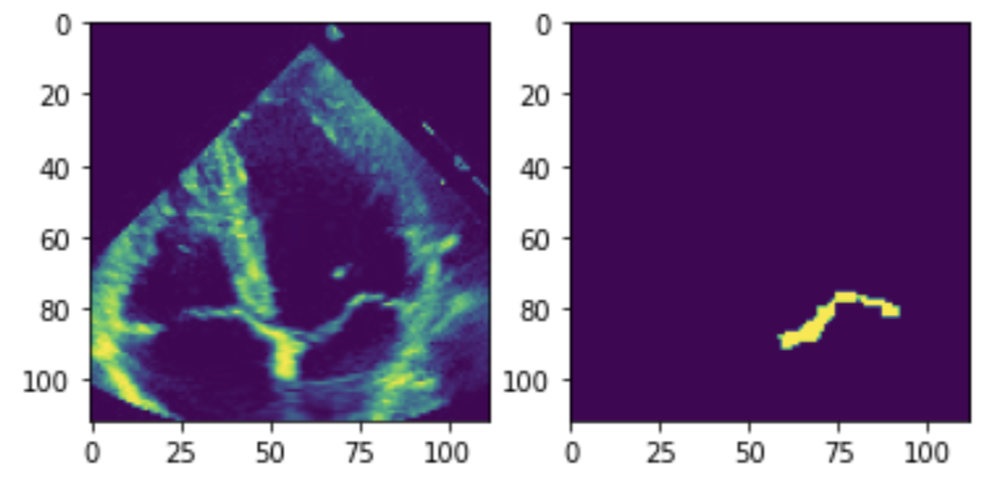

# Advanced-ML-ETHZ

## Arrhythmia Classification of ECG Signals
This project aims to classify the ECG signal of a patient (i.e. a series of consecutive heartbeats) into four different classes, which are illustrated in Figure 1. One of the classes contains healthy patients, while the other three contain patients with different kinds of arrhythmia.

Figure 1: Average heartbeat for the 4 different classes.

Our pipeline can be briefly summarized as follows. First, the ECG signal is split into its single heartbeats (see Figure 2). From these, we engineer a plethora of features. These include heart-rate variability features (by far the most common in the literature), frequency-domain features, features extracted via an auto-encoder, higher-order statistics and other hand-designed features based for example on the location of different heart-beat peaks (see Figure 3). Eventually, we build an ensemble of several Gradient Boosting classifiers trained on different subsets of features.

Figure 2: ECG signal of a patient.

Probably the most challenging part was dealing with the fact that for many signals some of the features could not be computed (mainly due to the failure of the segmentation algorithm that extracts the single heart-beats). For this reason it was vital to avoid interdependencies in the computation of different features and to push the error-handling down the pipeline as low as possible.

Figure 3: Location of different peaks in a heartbeat.

---

## Mitral Valve Segmentation
The segmentation of the mitral valve from an echocardiogram video is usually a key step in any automated pipeline for the diagnosis of diseases affecting the mitral valve. To tackle this task we relied on a convolutional neural network architecture often used for the segmentation of biomedical images called U-Net. One of the main challenges was the limited size of the training data that consisted of a few dozens of videos. To deal with this issue we used a network with pretrained weights (that we fine-tuned on our data) and multiple data-augmentation techniques (e.g. grid distortion). Finally, to gain some additional robustness, for the final model we opted for an ensemble of a handful of such networks.

Figure 4: Frame from an chocardiogram on the right and the corresponding mask on the left.
